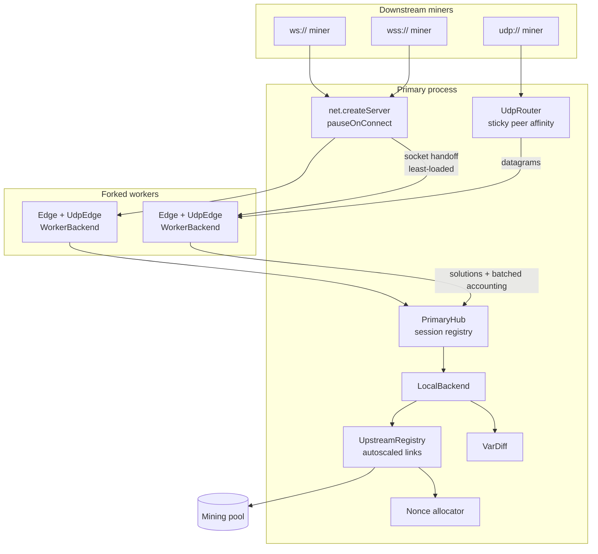

# NMiner

[](https://github.com/dev-swarup/NMiner/releases)
[](https://www.npmjs.com/package/nminer)
[](https://github.com/dev-swarup/NMiner/blob/master/LICENSE)
[](https://github.com/dev-swarup/NMiner/stargazers)

A high-performance, cross-platform **RandomX CPU miner shipped as a Node.js addon**, plus **NMinerProxy** — a clustered stratum proxy that terminates thousands of miners, accounts their shares, and multiplexes them onto a self-scaling pool of upstream pool connections.

Two layers, cleanly separated:

* a **native C++ addon** (`NMiner.node`) that owns all hashing, dataset memory, thread pinning and nonce iteration;
* a **thin TypeScript layer** that speaks Stratum, allocates nonce ranges, tunes difficulty and orchestrates workers. No hashing logic lives in JS.

RandomX is a proof-of-work algorithm optimized for general-purpose CPUs. It uses random code execution together with memory-hard techniques to minimize the efficiency advantage of specialized hardware.

---

## Contents

* [Features](#features)
* [Install](#install)
* [Quick start](#quick-start)
* [NMiner](#nminer-1) — [options](#mineroptions) · [methods](#methods)
* [NMinerProxy](#nminerproxy) — [architecture](#proxy-architecture) · [load balancing](#load-balancing) · [options](#proxyoptions) · [events & API](#events--api)
* [Transports and encryption](#transports-and-encryption)
* [Performance](#performance)
* [Logging](#logging)
* [Building from source](#building-from-source)
* [Acknowledgements](#acknowledgements) · [Donations](#donations)

---

## Features

| | |
|---|---|
| **Native RandomX** | JIT-compiled VMs for x86-64, ARM64 and RISC-V, with AVX2 / VAES / SSE4.1 / AES-NI paths selected at build time |
| **FAST & LIGHT modes** | Full 2 GB dataset for maximum hashrate, or 256 MB cache-only for constrained hosts |
| **NUMA aware** | One dataset per NUMA node, threads pinned to cores via hwloc, thread count derived from L2/L3 capacity |
| **Huge pages** | Probed and enabled automatically (`SeLockMemoryPrivilege` on Windows, `nr_hugepages` on Linux) |
| **Never blocks the loop** | Dataset (re)allocation runs on an `AsyncWorker`; mining runs on raw threads reporting back through a `ThreadSafeFunction` |
| **Four transports** | `stratum+tcp://`, `stratum+ssl://`, `ws://`/`wss://`, and `udp://` |
| **Encrypted proxy protocol** | secp256k1 ECDH handshake + ChaCha20-Poly1305 AEAD on every downstream frame |
| **Self-clustering proxy** | Forks and supervises its own workers, distributing accepted sockets to the least-loaded one |
| **Upstream autoscaling** | Opens, packs and consolidates pool links on demand; grants nonce ranges hashrate-proportionally |
| **Vardiff** | Per-miner difficulty from measured hashrate, settled in the worker that owns the connection |
| **SOCKS4/5 proxy support** | For both the miner and the proxy's upstream leg |

---

## Install

```bash
npm install --save nminer
```

Prebuilt binaries for `win32`/`linux` × `x64`/`arm64` are published with each release; the loader picks `bin/nminer-<platform>-<arch>.node` and falls back to a locally compiled `build/Release/NMiner.node`.

**Requirements:** Node.js ≥ 18 (Bun is detected and supported).

---

## Quick start

Mine to a pool:

```javascript
const { NMiner } = require("nminer");

new NMiner("stratum+tcp://pool.supportxmr.com:3333", "YOUR_WALLET_ADDRESS", "x", {
    mode: "FAST"
});
```

Run a proxy that fans hundreds of miners onto a handful of pool logins:

```javascript
const { NMinerProxy } = require("nminer");

const proxy = new NMinerProxy("stratum+tcp://pool.supportxmr.com:3333", "YOUR_WALLET_ADDRESS", "x", {
    port: 8080,
    udpPort: 8080,
    logging: "info"
});

proxy.on("share", (address, difficulty, height) => console.log("accepted", address, difficulty, height));
```

Point miners at it with `ws://proxy-host:8080` or `udp://proxy-host:8080`.

---

## NMiner

Connects to a single pool, resolves the announced algorithm, drives one native job and submits shares.

```ts
new NMiner(pool?: string, address?: string, options?: MinerOptions);
new NMiner(pool?: string, address?: string, pass?: string, options?: MinerOptions);
```

| Parameter | Default | Notes |
|---|---|---|
| `pool` | `stratum+tcp://pool.supportxmr.com:3333` | Any supported [transport URL](#transports-and-encryption) |
| `address` | built-in donation address | Wallet / pool login |
| `pass` | `"x"` | Pool password or worker name |

### MinerOptions

```ts
interface MinerOptions {
    mode?: "FAST" | "LIGHT";     // dataset strategy          (default "FAST")
    algo?: "rx/0" | "rx/monero" | "rx/v2";  //                (default "rx/0")

    threads?: number;            // override the auto-derived thread count
    proxy?: string;              // socks4://, socks4a:// or socks5:// URL
    throttle?: boolean;          // sine-wave duty cycling of the mining threads
    nicehash?: boolean;          // reserve the top nonce byte for the pool
    keepalive?: boolean;         // force keepalived pings even if unadvertised
    strictTls?: boolean;         // verify the pool certificate on stratum+ssl

    logging?: boolean | Level;   // (default true, i.e. "info")
    logger?: Logger | Sink;      // custom logger or entry sink
}
```

The pool's announced `algo` wins over `options.algo`: if a job carries an algorithm outside `rx/0`, `rx/monero`, `rx/v2` the connection is closed with an error rather than mining the wrong chain. A change of `seed_hash` or variant triggers a background dataset rebuild; the mining threads are stopped and restarted around it, and the event loop stays responsive throughout.

When the upstream is an NMinerProxy (`ws://`, `wss://`, `udp://`), jobs arrive carrying a `start_nonce`/`nonce_limit` grant. The miner then measures its own hashrate with an EWMA, keeps roughly ten seconds of nonces queued ahead, and polls `get_chunk` twice a second for more — with backoff when the proxy answers `retry_after`, and silent re-arming when it answers `migrated` or `job_expired`.

### Methods

```ts
miner.throttle(threads: number, ms: number): void;   // park `threads` workers for `ms`
```

### Examples

```javascript
// LIGHT mode over SOCKS5, four threads
new NMiner("stratum+tcp://pool.example.com:3333", "wallet", {
    mode: "LIGHT",
    threads: 4,
    proxy: "socks5://127.0.0.1:1080"
});

// Encrypted WebSocket link to your own proxy
new NMiner("wss://proxy.example.com:8080", "wallet");

// Datagram transport — lowest overhead, survives packet loss
new NMiner("udp://proxy.example.com:8080", "wallet");
```

---

## NMinerProxy

`NMinerProxy` terminates many downstream miner connections and represents them upstream as a small number of real Stratum logins. It is not a passive relay: it slices the nonce space so no two miners overlap, assigns each miner its own difficulty, and absorbs everything that does not meet the pool target.

```ts
new NMinerProxy(pool?: string, address?: string, options?: ProxyOptions);
new NMinerProxy(pool?: string, address?: string, pass?: string, options?: ProxyOptions);
```

### Proxy architecture



**Primary owns all pool state.** Workers hold none: a worker is an `Edge` (WebSocket) plus a `UdpEdge` (datagram) driving a `WorkerBackend`, which forwards `login` / `chunk` / `close` over IPC. That means crypto, framing, JSON and socket bookkeeping — the expensive per-miner work — scale across cores, while difficulty, nonce accounting and upstream links stay single-sourced and consistent.

**Shares settle in the worker.** `submit` is the one call that does *not* round-trip. Each worker mirrors the target, the pool target and the nonce ledger it was handed for its own sessions, so it answers the miner immediately: a share below the pool target is tallied locally and shipped to the primary as a 5-second aggregate, and only a real pool-target solution is pushed across IPC. Share traffic therefore costs zero round-trips per submit no matter how many miners a worker holds.

**Socket handoff, not `cluster`.** The primary listens with `pauseOnConnect` and hands the raw socket to the least-loaded child, which is a `child_process.fork` of the package's own `worker.js` — never `cluster.fork`, and never the user's entry script. NMiner therefore clusters itself correctly even when embedded in an application that is already clustered. If a foreign manager (pm2, `cluster`) is detected, every instance but the first idles with a warning, because a second live instance would mean a second upstream login and a duplicated nonce space.

**Everything is batched.** All primary↔worker traffic other than socket handoff is coalesced on `setImmediate` into a single `{ t: "batch" }` message (flushed early at 256 entries). Job fanout to thousands of sessions therefore costs a handful of IPC writes per tick rather than one per miner — this is what makes the fleet affordable at scale.

**Workers are supervised.** Exits are respawned with exponential backoff (500 ms → 15 s, reset after 30 s of health); sockets arriving while no child is available are queued (up to 1024) and handed to the next spawn; sessions belonging to a dead worker are evicted from the hub and their upstream slots released.

### Load balancing

Load balancing happens at four independent levels.

**1 — Connections across workers.** Least-loaded selection at accept time, with live load tracking as sockets close. UDP peers are sharded the same way but with **sticky affinity**: a peer key (`address:port`) is pinned to one worker for the life of its session so its retransmit and ack state stays in one place.

**2 — Miners across upstream links.** `Upstream` maintains a pool of Stratum links per `{pool, address, pass, proxy}` tuple. Each link learns its own job interval (EWMA plus a decaying worst case) and derives a **capacity** — how many hashes its nonce space can cover before the next job invalidates it. Miners are placed **best-fit**: the link with the *smallest sufficient* headroom (capacity × 0.8 − load) wins, which packs links tightly and leaves the roomy ones free for large miners. When no link has room, a new one is opened; when demand falls, `consolidate()` drains the least-loaded link onto its peers and idle links are closed after 60 s. A rebalance sweep runs every 15 s and migrates miners off any link that has drifted over capacity. `maxLinks` (default 64) caps the growth.

**3 — Nonce space across miners.** `nonce.ts` is a pure segmented allocator over the 2³² nonce space, or over 2²⁴-wide slots when a job is NiceHash-style (the pool has reserved the top nonce byte). Each grant is sized from the miner's measured hashrate and the time left before the next job — `hashrate × min(20 s, deadline)`, clamped to [4096, 2²⁸] — so fast miners get large chunks and slow ones do not sit on space they will never search. Every grant is recorded in a per-miner ledger covering the current *and* previous job, so a share arriving late is still credited while an out-of-range nonce is rejected outright. If several links share a NiceHash job, `expandNicehash` redistributes the unclaimed slots among them, and self-disables the moment the pool starts rejecting shares whose slot byte does not match.

**4 — Difficulty per miner.** `vardiff.ts` targets a share every ~15 s from the miner's share-based hashrate estimate, retuning only when the desired difficulty drifts by more than 1.3×. Two invariants hold: the assigned difficulty is **never** above the pool's, and the recorded difficulty is always `targetDifficulty()` of the target actually handed out — so credited work equals proven work. `floor()`/`settle()` keep the previous target valid across a retune, so shares already in flight are never rejected for a difficulty change they could not have seen.

**Share path.** On `submit` the proxy checks that a job is active, that the nonce is inside a range that miner owns, and that the submitted result meets the difficulty that miner was assigned. It does **not** re-hash the share: the proxy takes the result at its word and lets the pool be the authority on validity. Shares below the pool target are **absorbed**: accounted for the miner, never forwarded. Only real pool-target solutions travel upstream, which is what keeps upstream chatter flat as the miner count grows.

### ProxyOptions

`ProxyOptions extends MinerOptions`, so `proxy`, `keepalive`, `strictTls`, `algo`, `logging` and `logger` all apply to the upstream leg.

```ts
interface ProxyOptions extends MinerOptions {
    port?: number;               // WebSocket listener            (default 8080)
    udpPort?: number;            // datagram listener             (off unless set)

    cluster?: boolean | number;  // worker count; true = auto, false = single process
    maxLinks?: number;           // upstream links per pool tuple (default 64)
    expandNicehash?: boolean;    // claim unused nicehash slots   (default false)

    authorize?: (username: string, password: string) => boolean | Promise<boolean>;
}
```

`cluster` defaults to `cores <= 2 ? 0 : min(cores - 2, 8)` — two cores are left for the primary and its upstream I/O, and the ceiling of 8 reflects that batching, not worker count, is the real limit. Set `cluster: false` to run everything in one process (useful under a supervisor, or for debugging).

The proxy holds no RandomX dataset of its own. Shares are accepted on arithmetic checks alone — job, nonce range and assigned difficulty — and the pool is the authority on whether a forwarded solution is real, so a proxy host needs no mining-sized memory.

### Events & API

```javascript
proxy.on("share", (address, difficulty, height) => { /* accepted by the pool, difficulty is the pool share difficulty */ });
proxy.on("work",  (address, difficulty, forwarded, solved) => { /* every valid share */ });
```

```ts
proxy.stats();        // { accepted, rejected, absorbed, work, solved, idle,
                      //   workers: [{ id, load, uptime }],
                      //   miners:  [{ address, hashrate, difficulty, shares, work, solved }],
                      //   pools:   [{ pool, miners, links: [{ miners, slot, interval, worst,
                      //                                       load, capacity, left }] }] }

proxy.switch_pool({ pool, address, pass, proxy? });   // re-home every miner onto a new pool
proxy.close();                                        // stop listeners, workers and links
```

Gate logins with `authorize`; throwing or returning `false` rejects the miner before any upstream connection is made.

```javascript
const proxy = new NMinerProxy("stratum+tcp://pool.example.com:3333", "wallet", "x", {
    port: 4444,
    cluster: 4,
    authorize: async (username, password) => await db.workerExists(username, password)
});

proxy.on("work", (address, difficulty, forwarded) => meter.add(address, difficulty, forwarded));
setInterval(() => console.log(proxy.stats()), 30000);
```

---

## Transports and encryption

| URL scheme | Protocol | Encryption |
|---|---|---|
| `stratum+tcp://` | Real Stratum, newline-delimited JSON-RPC | none |
| `stratum+ssl://` | Stratum over TLS (`strictTls` to verify certificates) | TLS |
| `ws://` / `wss://` | NMiner proxy protocol, array-framed JSON-RPC | ECDH + ChaCha20-Poly1305 (plus TLS on `wss`) |
| `udp://` | Same protocol over datagrams with ack/retransmit | ECDH + ChaCha20-Poly1305 |

The proxy protocol carries `login` / `get_chunk` / `submit` / `keepalived`, plus server-pushed `job` and `error` frames.

**Handshake.** The client generates a secp256k1 ECDH keypair and sends its public key — as the `x-salt` header on WebSocket upgrade, or as a `HELLO` datagram. The proxy answers with its own public key, both sides compute the shared secret, and the session key is `SHA-256(secret ‖ "nminer-salt")`.

```
Client                                        Proxy
  |---- x-salt: client public key ------------->|
  |<--- x-salt: proxy public key ---------------|
  |  (derive shared secret)   (derive shared secret)
  |<==== ChaCha20-Poly1305, 12-byte nonce ====>|
```

**Frames.** Each frame is a fresh random 96-bit nonce ‖ 128-bit Poly1305 tag ‖ ciphertext, base64url-encoded. The tag makes tampering and replay of mutated frames detectable; a failed decrypt drops the frame and, before login, the connection.

**UDP reliability.** `udp.ts` adds a small sequence/ack layer over datagrams — 700 ms retransmit, five attempts, a 256-entry dedupe window and a peer sweep every 30 s — because silent packet loss would otherwise eat share submissions. Payloads above 60 000 bytes are dropped rather than fragmented. The `UdpClient` is duck-typed to the WebSocket surface, so `udp://` needs no special case anywhere in the client.

---

## Performance

### How the thread count is chosen

RandomX is memory-bound: each thread needs a **2 MB scratchpad** whose hot 256 KB wants to live in L2, and threads that share a cache domain past that point cost hashrate instead of adding it. NMiner therefore does not default to `os.cpus().length`. Per NUMA node it computes

```
threads = min(physical cores, L3 bytes / 2 MB, L2 bytes / 256 KB)
```

from a live hwloc scan, sums the result across nodes, and splits it evenly with each thread pinned to a core. `threads` in the options overrides this if you know better. `cacheInfo()` exposes the same scan, including which Blake2/AES implementation was selected.

### Memory

| Mode | Resident | Use |
|---|---|---|
| `FAST` | ~2080 MB dataset **per NUMA node**, plus scratchpads | Maximum hashrate |
| `LIGHT` | 256 MB cache, plus scratchpads | Low-memory hosts, many-instance boxes |

Huge pages are probed at startup and enabled where possible — `SeLockMemoryPrivilege` is granted to the current user on Windows (a re-login is reported when a restart is required), `/proc/sys/vm/nr_hugepages` is raised on Linux. This is one of the largest single hashrate factors on most CPUs; `PrintTopology` reports the outcome as *permission granted* / *restart required* / *not supported*.

### Hot path

* RandomX programs are **JIT-compiled** per VM (x86-64, ARM64 and RISC-V backends, with hand-written ASM templates on x86).
* Build selects **VAES-512 → AES-NI** for scratchpad fills and **AVX2 → SSE4.1 → reference** for Blake2/Argon2, per architecture.
* Release builds use `/O2 /Oi /Ot /GL /Ob2` + LTCG on MSVC and `-O3 -flto -funroll-loops` on GCC/Clang; `-DARCH=native` adds `-march=native` (or `/arch:AVX2`) for self-built binaries.
* Job state, hash counters and the nonce range are **cache-line aligned atomics**, so mining threads iterate nonces without touching a mutex.
* Dataset (re)allocation is the only thing that goes through an `AsyncWorker`; found shares cross into JS through a `ThreadSafeFunction`. **The event loop is never blocked**, so a miner embedded in a server keeps serving.
* Job version numbers travel with every share, so results found against a job that has just been replaced are still matched to the right `job_id` and difficulty (16 versions are retained) instead of being submitted blind.

### Proxy throughput

* **Per-miner cost scales across cores.** Crypto, framing and socket handling live in workers; the primary only touches accounting-sized messages.
* **Shares never round-trip.** A worker answers `submit` from its own mirror of the target and nonce ledger; absorbed shares reach the primary as one aggregate per session per 5 s, and only pool-target solutions cross IPC at all.
* **IPC is amortized.** Batched on `setImmediate`, so a new job reaching *N* sessions is a small constant number of writes per worker, not *N*.
* **Target math is memoized.** Hex targets decode to their 64-bit value and difficulty once and are cached, so the per-share path is a BigInt comparison rather than a buffer parse and a division.
* **Timers are swept, not churned.** Idle miners are reaped by one periodic sweep per edge instead of a timer reset on every frame.
* **Upstream chatter stays flat.** Absorbed shares (below pool target) never leave the process; only real solutions are forwarded, and the upstream link count tracks aggregate hashrate rather than miner count.
* **Nonce grants are demand-sized.** Chunks are cut to about 20 s of the miner's measured work, bounded by the job deadline, so a fast miner makes one request where a fixed-size allocator would make dozens.

`stats()` is the instrument for all of this — per-worker load, per-miner hashrate and difficulty, and per-link capacity/load/space-remaining.

### Stealth throttling

`throttle: true` on `NMiner` parks a varying subset of threads on a sine curve with random jitter, and `miner.throttle(threads, ms)` does it explicitly. Useful when the miner shares a host with latency-sensitive work.

---

## Logging

`NMiner` and `NMinerProxy` log through one leveled, scoped logger. `logging` picks the level, `logger` decides where entries go.

```ts
type Level = "silent" | "error" | "warn" | "info" | "debug";
type Kind  = "error" | "warn" | "info" | "success" | "debug";

interface Entry {
    time: number;                        // epoch ms
    kind: Kind;                          // "success" is an info-level accent, not its own level
    scope: string;                       // program, net, pool, cpu, randomx, share, udp, fleet, proxy
    message: string;
    fields?: { [key: string]: unknown };
}
```

`logging: true` means `"info"`, `false` means `"silent"`, and a level name selects it directly. Every line renders as `[timestamp] scope message key value`, so a field named after what it carries reads as prose:

```
[2026-08-13 12:04:11.882]  net      listening port 8080 workers 6 upstream primary
[2026-08-13 12:04:12.317]  pool     link up host pool.supportxmr.com links 1
[2026-08-13 12:04:35.104]  net      new job from pool.supportxmr.com diff 30000 algo rx/0 height 3312001
[2026-08-13 12:04:39.550]  share    accepted (1/0) diff 30000 solved 75000 total 75000 (214 ms)
```

Four field names are rendered rather than labelled: `accepted`/`rejected` collapse into `(1/0)` with the reject count in red, `reason` prints bare in the entry's color, and `took` trails the line as `(214 ms)`. Everything else is `key value`, and the sink still receives all of them as plain fields.

Pass `logger` a function to redirect the stream — the console sink is replaced, not duplicated:

```javascript
const proxy = new NMinerProxy(POOL, ADDR, "x", {
    logging: "debug",
    logger: entry => bunyan.info(entry)     // or JSON.stringify(entry), or a file
});
```

Workers ship their entries to the primary over IPC, so a custom sink sees the whole fleet on one process, each entry tagged `worker=<id>`. Passing a `Logger` instance shares it, and `logger.level = "debug"` at runtime re-levels every scope on the primary at once; workers inherit the level as they spawn. Set `NO_COLOR` to disable ANSI output.

---

## Building from source

```bash
git clone https://github.com/dev-swarup/NMiner.git
cd NMiner
npm install
npm run tsc      # compile index.ts and src/js/*.ts (outputs are committed)
npm run build    # cmake-js -> build/Release/NMiner.node
```

Requires CMake ≥ 3.15, Python 3, and a C++17/20 toolchain (MSVC on Windows, GCC or Clang on Linux). `3rdparty/hwloc` is bundled for topology detection.

Useful CMake switches: `-DARCH=native` (tune for this exact CPU), `-DWITH_ASM`, `-DWITH_AVX2`, `-DWITH_VAES`, `-DWITH_SSE4_1`.

CI builds win32/linux × x64/arm64 and publishes to npm and GitHub Releases on commits beginning with `Release:`.

---

## Acknowledgements

* [tevador](https://github.com/tevador) — RandomX author
* [SChernykh](https://github.com/SChernykh) — major contributions to the RandomX design and implementation
* [hyc](https://github.com/hyc) — original idea of random code execution for PoW
* [swarup](https://github.com/dev-swarup) — NMiner: RandomX as a Node.js addon, with the encrypted clustered proxy

## License

BSD-3-Clause. See [LICENSE](LICENSE).

## Donations

If NMiner is useful to you:

**XMR:** `49ofeDTjSQXJQDUaaFYZm4fF7zG7v1GN5LkJKLj1vkH5FXh2ipReU3SMkSB4ERTAeiiQpYragiKmS8VY5KmRXxqkSfNH73T`
